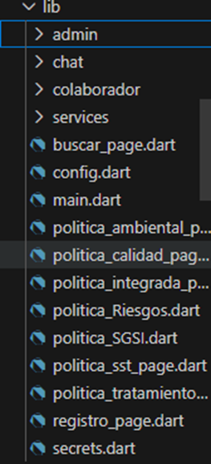
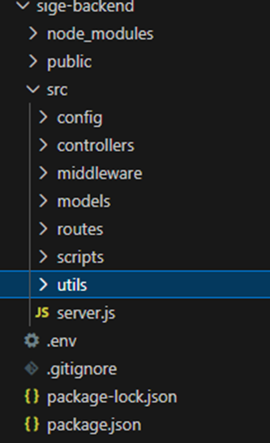
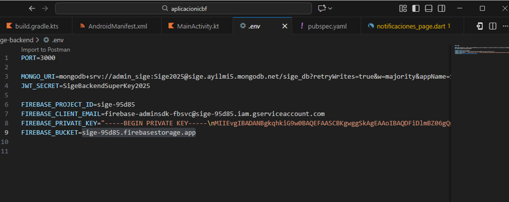

# 📱 Aplicación SIGE – Sistema Integrado de Gestión Educativa

Practica Profesional – Desarrollo de Software Móvil y Backend
----------------------------------------------------------------
# 📝 Descripción del Proyecto

Este repositorio contiene el desarrollo de una aplicación móvil creada como práctica profesional para el manejo de arquitecturas distribuidas, backend con Node.js, integración con servicios en la nube (Firebase y Render) y una interfaz móvil construida con Flutter.

La aplicación SIGE permite centralizar y visualizar información institucional relacionada con políticas, documentos y contenidos de inducción del ICBF, además de gestionar usuarios, roles, políticas y notificaciones desde un panel administrativo.

Este proyecto integra habilidades de ingeniería de sistemas, desarrollo móvil, desarrollo backend y despliegue en la nube.
----------------------------------------------------------------
🚀 Características Principales

# Aplicación Móvil (Flutter):

* Visualización de las políticas institucionales

* Módulo de Misión, Visión, Valores y Objetivos

* Inicio de sesión y registro con validación

* Subida de fotos de perfil a Firebase Storage

* Búsqueda avanzada de políticas

* Notificaciones internas

* Panel administrativo para roles especiales

--------------------------------------------------------------- 
# Backend (Node.js + Express)

* API REST robusta y segura

* Autenticación con JWT

* CRUD de documentos PDF

* Manejo de roles (Colaborador, Administrador, Coordinador)

* Generación de notificaciones automáticas

* Conexión a MongoDB Atlas
--------------------------------------------------------------
# Infraestructura

* Backend desplegado en Render

* Base de datos en MongoDB Atlas

* Archivos PDF y fotos alojados en Firebase Storage

* Repositorio controlado con Git y GitHub
------------------------------------------------------------
# 🛠️ Tecnologías Utilizadas
# Frontend

* Flutter 3.x
* Dart
* Material Design
* ImagePicker
* Flutter DotEnv

# Backend

* Node.js 18
* Express.js
* Mongoose
* Firebase Admin SDK
* Bcryptjs
* Helmet & CORS

# Infraestructura

* Render (Web Service)
* MongoDB Atlas
* Firebase Storage
* Git & GitHub
------------------------------------------------------------
# 📁 Estructura del Proyecto

-------------------------------------------------------------
# ⚙️ Instalación y Ejecución

1. Clonar el repositorio
git clone https://github.com/Carlos060801/Practica-ICBF.git 

2. Backend – Instalación
* cd repo-backend
* npm install
* npm start

Crear archivo .env con:

----------------------------------------------------------------
# Aplicación Flutter
* cd repo-app
* flutter pub get
* flutter run
---------------------------------------------------------------
# Generar AAB:

* flutter build aab --release
----------------------------------------------------------------
# 🌐 Despliegue en Render

El servidor backend se encuentra desplegado en:

https://sige-backend.onrender.com 

https://dashboard.render.com/web/srv-d4rhhnfpm1nc738hcbig 

Render realiza despliegues continuos (CI/CD) con cada commit en la rama main.
------------------------------------------------------------------
# 🧪 Pruebas

* Pruebas de endpoints con Postman / Thunder Client
* Validación de UI en dispositivos Android 14–18
* Pruebas de carga básica para API REST
* Validación de subida de archivos a Firebase Storage
-------------------------------------------------------------------
📄 Documentación del Proyecto

Se incluyen:

📘 Manual de Usuario
📗 Manual Técnico
📗 Diapositivas 
# Diagramas 
🗺 Diagramas C4 (Niveles 1,2,3)
🔄 Diagrama de Caso de Uso 
🔄 Diagrama de Clases
🔄Diagrama de Deploy
🔄 BPMN de procesos
🧩 Diagramas UML (Clases, Secuencia)
# Proyecto 
Ubicados en: 
repo-documentos
---------------------------------------------------------------------
👨‍💻 Autor

Carlos Daniel Culma Perdomo
Estudiante de Ingeniería de Sistemas – CORHUILA
Desarrollador de Software Móvil & Full Stack JR

GitHub: Carlos060801